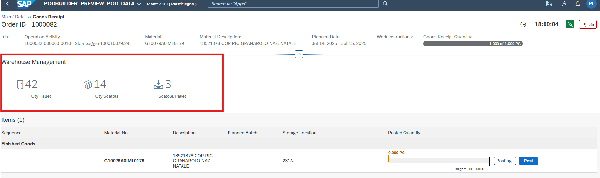
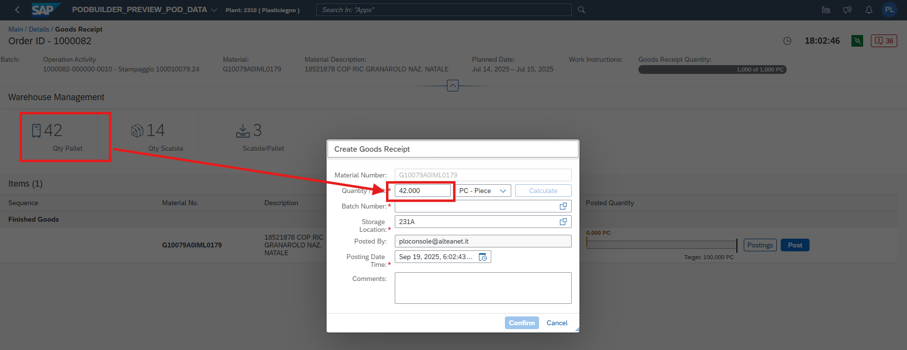
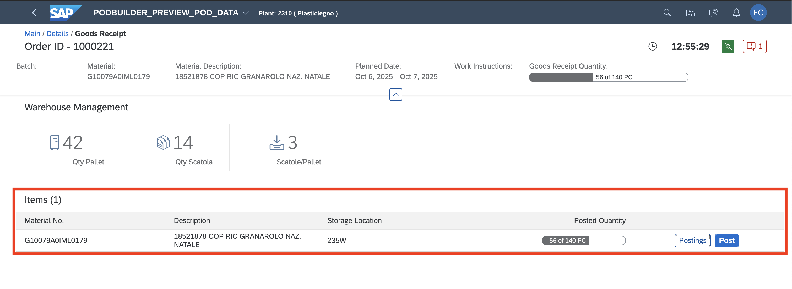
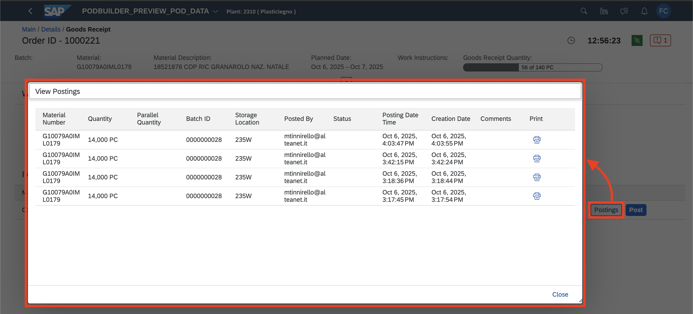
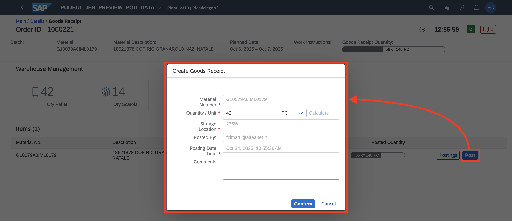

# DMC-Plugin_WM-NormeImballoProdottoFinito
## Come fare build e deploy
1. vai su /testPlugin/package.json
2. clicca su login (oppure sul terminale scrivere npm run login)
3. dopo aver completato il login, vai sempre su /testPlugin/package.json e clicca su build-deploy (oppure sul terminare scrivere npm run build-deploy)

## Cosa fare dopo ogni modifica?
### Commit e Push delle modifiche
#### Regole
1. inserire sempre le proprie iniziali come titolo del commit ed una breve descrizione. Es: PL - Fix salvataggio imballo

## Funzionalità incluse
### 1. Richiamo norme di imballo prodotto finito

### 2. Settaggio automatico della quantità sul Goods Receipt

### 3. Visualizzazione tabella Goods Receipt

### 4. Visualizzazione dello storico dei Goods Receipt

### 5. Creazione del Goods Receipt

